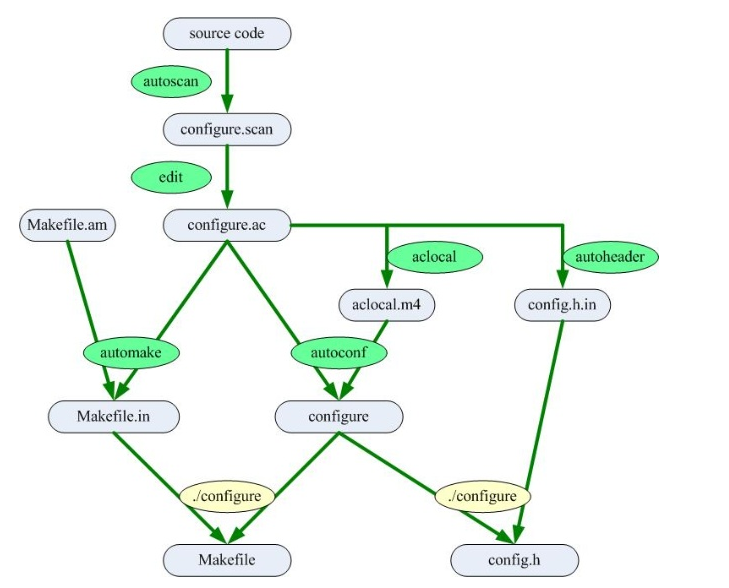

flow_intent
============

     流程越复杂,产出的架构越清晰,文件越分散
     下面说一下这些流程的作用

.. code-block:: shell

     第一次的流程

     1/
     手动 创建 源代码 ,手动创建Makefile.am
          Makefile.am 用来被automake  做成 Makefile.in
               Makefile.in 用来被 ./configure 做成 Makefile

     2/
     autoscan
          用来生成 configure.scan
     
     3/
     mv configure.scan configure.ac
     
     4/
     autoheader
          用来生成 config.h.in
               config.h.in 被 ./cofnigure 做成 config.h
     
     5/
     手动 在 configure.ac 中 AC_INIT 后一行 添加 AM_INIT_AUTOMAKE           
          AM_INIT_AUTOMAKE 是automake 需要的
          
     
     6/
     aclocal
          aclocal是一个perl脚本程序.aclocal根据configure.ac文件的内容,自动生成aclocal.m4文件
     
     7/
     automake --add-missing --copy
          利用 Makefile.am 和 configure.ac 做成 Makefile.in
     
     8/
     autoconf
          利用 aclocal.m4 和 configure.ac 做成 configure

     9/
     ./configure
          利用 configure 和 Makefile.in 做成 Makefile
          利用 configure 和 config.h.in 做成 config.h

     10/
     make

     11/
     make install
     

     ----

     修改过源码之后的流程
     
     autoscan
     
     手动update configure.ac (compare configure.scan with configure.ac)
     
     autoreconf

操作流程
---------

从上图可以看出来,这个东西需要5个工具,需要编辑两个文件

参考文档
--------

`autotools2`_
.. _`autotools2` : http://www.lugod.org/presentations/autotools/presentation/autotools.pdf
